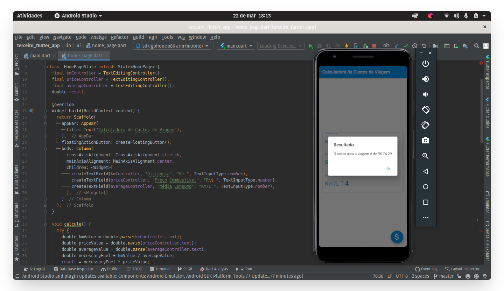

## :car: Calcule os custos de uma viagem :car:
> Meu terceiro App criado com Flutter, que é um trabalho da aula de Dispositivos Móveis, ministrado pelo professor Marcos Dias Vendramini.

O App calcula os custos de uma viagem, com base na distância (Km), preço do combústivel e a média de consumo do veículo (Km/L)

### Screenshot
